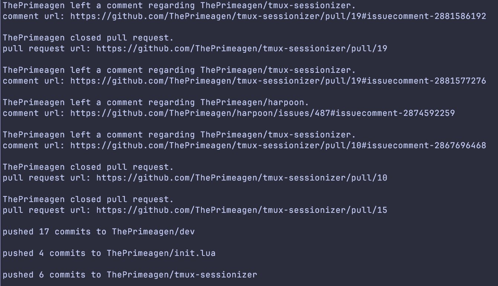

# python-projects

a repo for the projects i build in python (:

all you'll need is **python3** to run projects from this repo. any 3rd party libraries will be included within the respective project's ```requirements.txt```.

feel free to send any feedback my way! 

[LinkedIn](https://www.linkedin.com/in/ferrell-gray-ab3121182/)

## 1. Task Tracker CLI
- https://roadmap.sh/projects/task-tracker
- a simple CLI for setting up a tracking tasks. tasks can be added, removed, and moved to different statuses. some examples:

```bash
python3 main.py -h
# displays description of the task tracker. the -h flag can also be used on any command passed to the CLI for a description of available commands.
```


```bash
python3 main.py list-all
#lists all tasks
```

```bash
python3 main.py add "take out the trash"
#adds a new task in the TODO status
```

```bash
python3 main.py update-status "take out the trash" "TODO" "IN PROGRESS"
#moves the specified task from its current status to a given status
```

## 2. GitHub User Activity
- https://roadmap.sh/projects/github-user-activity
- a CLI for gathering recent github activity for a user-provided github username.

an example:

```bash
python3 main.py ThePrimeagen
```

will return:

