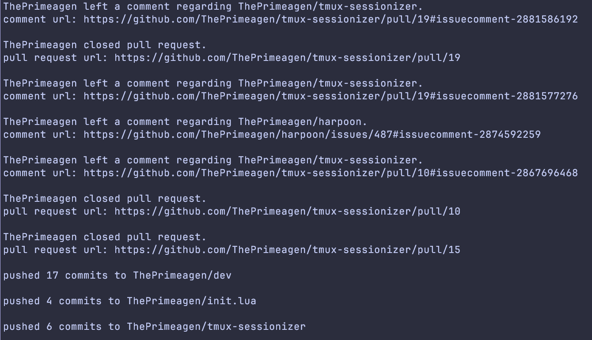

- https://roadmap.sh/projects/github-user-activity
- a CLI for gathering recent github activity for a user-provided github username.

an example:

```bash
python3 main.py ThePrimeagen
```

will return:

